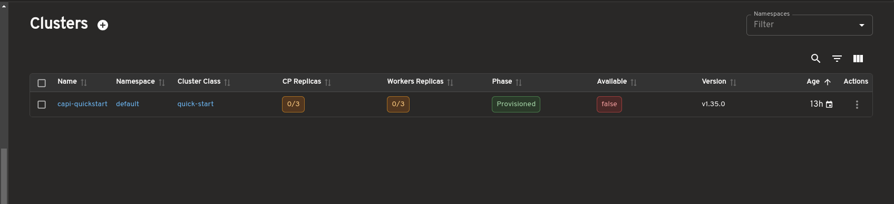
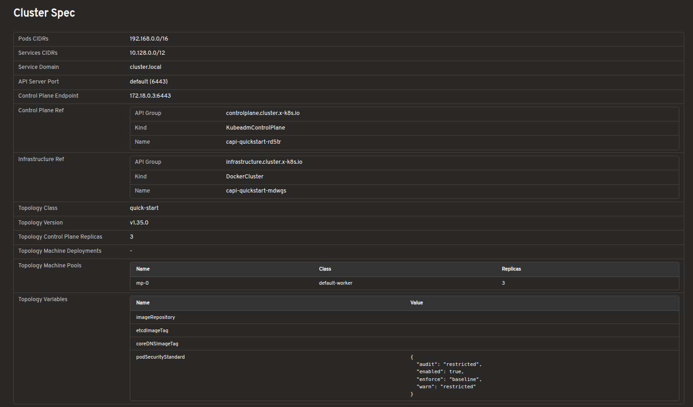
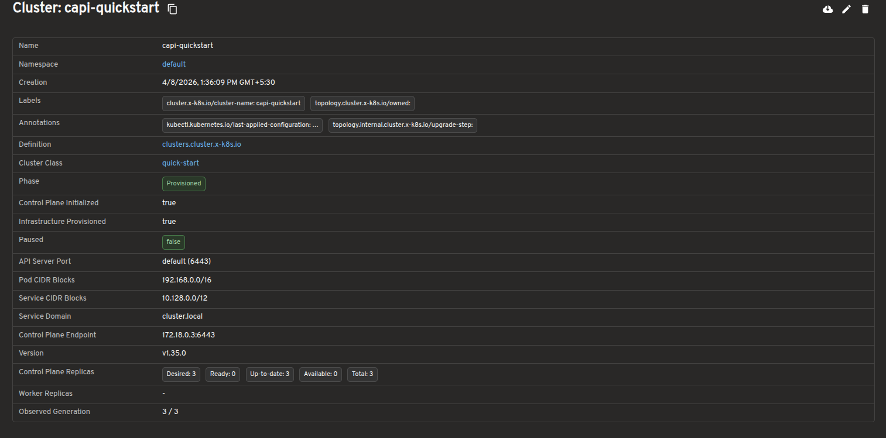
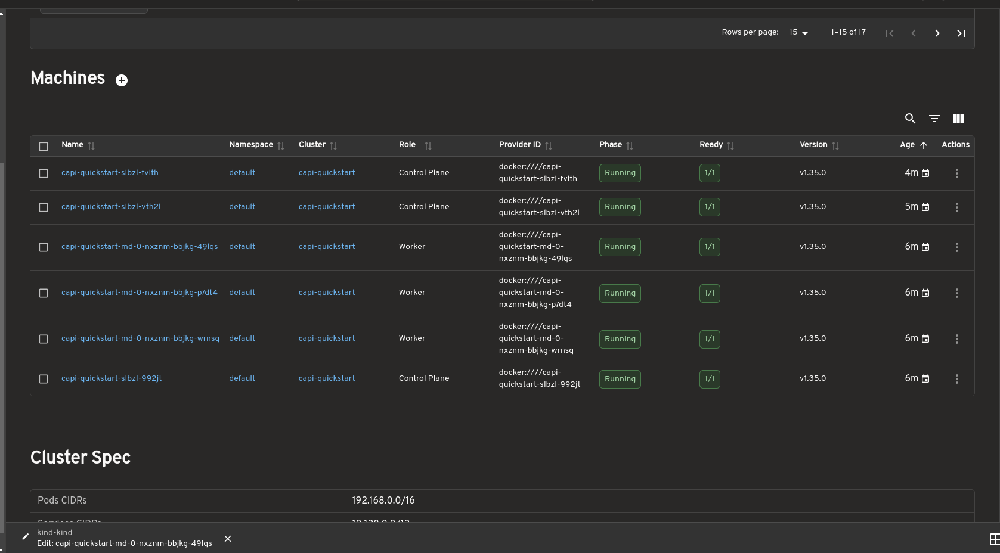
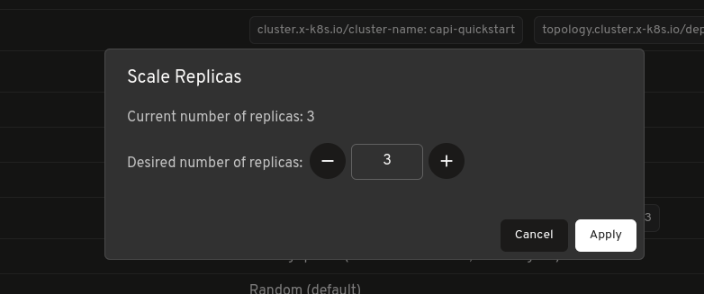
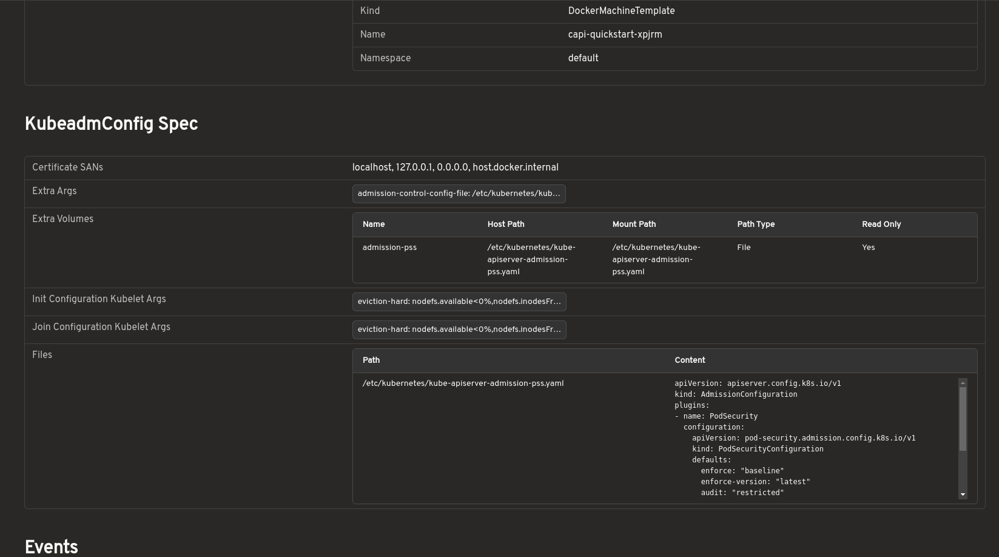

# [headlamp-k8s/plugins](https://github.com/headlamp-k8s/plugins): Introducing Cluster API Plugin 

[Headlamp](https://headlamp.dev/
) is an open-source, extensible Kubernetes SIG UI project designed to let you explore, manage, and debug cluster resources directly from a browser.

[Cluster API (CAPI)](https://cluster-api.sigs.k8s.io) is a Kubernetes sub-project that brings declarative, Kubernetes-style APIs to cluster lifecycle management. It lets platform teams provision, upgrade, and manage the lifecycle of Kubernetes clusters using standard Kubernetes objects stored and reconciled in a management cluster.

The new Headlamp Cluster API Plugin adds dedicated UI views for all core Cluster API resources directly to your Headlamp dashboard. You can browse clusters, inspect machines, track control plane health, scale deployments, and navigate the full CAPI object graph, all without leaving the browser.

Managing Cluster API resources has historically required raw kubectl commands and deep familiarity with ownership hierarchies. This plugin brings visual clarity, faster debugging, and simplified operations for platform teams, directly inside Headlamp.

---

## What This Plugin Provides

The Cluster API Plugin adds a dedicated Cluster API section to Headlamp and brings full visibility into core CAPI resources through consistent list and detail views.

| Feature | Description |
|---|---|
| **Cluster Overview** | View clusters with live control plane and worker replica status. |
| **Machine Visibility** | Inspect MachineDeployments, MachineSets, Machines, and MachinePools with status and conditions. |
| **Control Plane Monitoring** | Track KubeadmControlPlane replicas, versions, and associated Machines. |
| **Scale from the UI** | Scale MachineDeployments and MachineSets directly from Headlamp. |
| **Owned Resource Hierarchy** | Easily trace relationships between clusters, deployments, sets, and machines. |
| **KubeadmConfig Inspection** | View bootstrap configs, files, kubelet args, and join/init settings. |
| **Topology Awareness** | Automatically detect and label ClusterClass-managed resources. |
| **Map View** | Visualize Cluster, Control Plane, and Worker relationships. |
| **Dynamic API Versioning** | Supports both v1beta1 and v1beta2 Cluster API versions. |
| **Prometheus Metrics** | View live metrics from the [Headlamp Prometheus plugin](https://github.com/headlamp-k8s/plugins/tree/main/prometheus) inline on Cluster API resource detail pages. |
---

## A Tour of the Plugin

The Headlamp Cluster API Plugin brings core Cluster API resources into a consistent and visual interface inside Headlamp. Here are some of the key views included in the first release.

## Bring Full Cluster API Visibility into Headlamp

The Cluster list view shows all Cluster resources in the management cluster, including control plane and worker replica status. This makes it easier to understand overall cluster health at a glance.

The Cluster detail view provides resource status, conditions, infrastructure references, control plane references, and related Machines on a single page.

## Explore Cluster API Resources in a Visual Interface

Dedicated views are available for MachineDeployments, MachineSets, Machines, and MachinePools. These pages surface replica counts, ownership relationships, provider IDs, versions, and conditions to simplify day-to-day operations and debugging.

## Scale Workloads Directly from Headlamp

MachineDeployments and MachineSets include a built-in Scale action, allowing users to adjust replica counts directly from Headlamp without using terminal commands.

For topology-managed clusters, the plugin also indicates when scaling should be performed at the Cluster level.

## Inspect Bootstrap Configuration Without Raw YAML

Bootstrap configurations can be viewed in a structured format, including inline files, kubelet arguments, extra volumes, and join or init settings. This removes the need to inspect raw YAML or secrets manually.

## Visualize Cluster Relationships with Map View

A visual map view displays relationships between Cluster, Control Plane, and Worker resources. It offers a faster way to understand ownership hierarchies and overall cluster structure.

 
## Prometheus Metrics Integration
 
The Cluster API Plugin integrates with the [Headlamp Prometheus plugin](https://github.com/headlamp-k8s/plugins/tree/main/prometheus) to surface metrics directly inside Cluster API resource detail pages.
 
When the Prometheus plugin is installed and configured, metrics are embedded inline on the detail pages for Clusters, MachineDeployments, MachineSets, and Machines. This means you can view resource health and performance data alongside status conditions and ownership relationships, without switching to a separate dashboard.
 
This makes it easier to correlate infrastructure state with live metrics during debugging or day-to-day cluster operations, all from within Headlamp.

---

## How to Use

*Please see the [`plugins/cluster-api/README.md`](https://github.com/headlamp-k8s/plugins/blob/main/cluster-api/README.md) for installation and usage instructions.*

---

## Building During LFX Mentorship

This plugin was developed as part of the CNCF LFX Mentorship program under the Headlamp project. The mentorship provided an opportunity to work closely with the Headlamp community while building features to improve the Cluster API management experience.

During the mentorship, the focus was not only on implementing features, but also on understanding real-world usability challenges around Cluster API operations. Discussions with mentors and community members helped shape the plugin's direction, improve the user experience, and prioritize features most useful to platform teams.

The mentorship also provided valuable experience contributing to large open-source projects, collaborating with maintainers, participating in design discussions, handling release feedback, and iterating on features based on community input.

Work on the plugin is still ongoing, with additional improvements and features planned beyond the initial alpha release.

---

## Feedback and Questions

This is an alpha release, and community feedback directly shapes what comes next.

- **Bug reports:** [Open an issue](https://github.com/kubernetes-sigs/headlamp/issues)
- **Feature requests:** [Start a discussion](https://github.com/kubernetes-sigs/headlamp/discussions)
- **Contributing:** [PRs are welcome](https://github.com/kubernetes-sigs/headlamp/pulls)
- **Kubernetes Slack:** [Join the #headlamp channel](https://slack.k8s.io/) for questions and discussion

---

